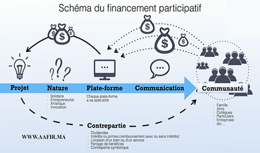

# Financement participatif ou Crowdfunding:

Le financement participatif est une nouvelle forme de financement qui permet à une entreprise de financer son projet auprès de la foule (particuliers, business Angels, etc.), par l'intermédiaire des plateformes de financement participatif. Ce mode comprend trois types de financement, le **Crowdlending** (prêt rémunéré par intérêts), le **Crowdequity** (financement contre participation au capital), le **Crowdcharity** (dons sans contrepartie ou dons avec contrepartie).

Ce type de financement est une alternative intéressante pour les entrepreneurs nouvellement installés grâce à son caractère moins exigeant.

### Le crowdfunding - Intervention d'Anne Delannoy, AMF

### Réferences
[Memoire : Le financement des PME en Côte d'Ivoire et au Maroc. Etude comparative](https://www.memoireonline.com/05/20/11851/m_Le-financement-des-PME-en-Cte-dIvoire-et-au-Maroc-Etude-comparative10.html)