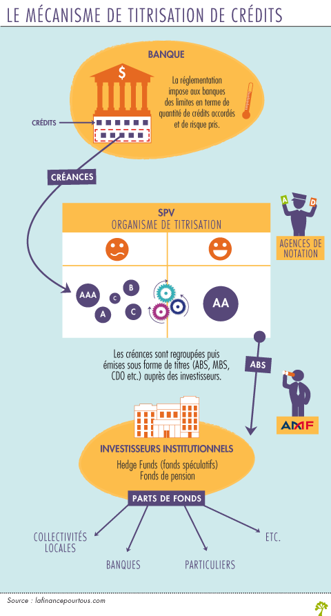

# Titrisation
La titrisation est une technique financière qui transforme des actifs peu liquides, c’est-à-dire pour lesquels il n’y a pas véritablement de marché tels que les crédits, en valeurs mobilières facilement négociables comme des obligations [Lire la suite...](https://www.lafinancepourtous.com/decryptages/marches-financiers/fonctionnement-du-marche/titrisation/)

