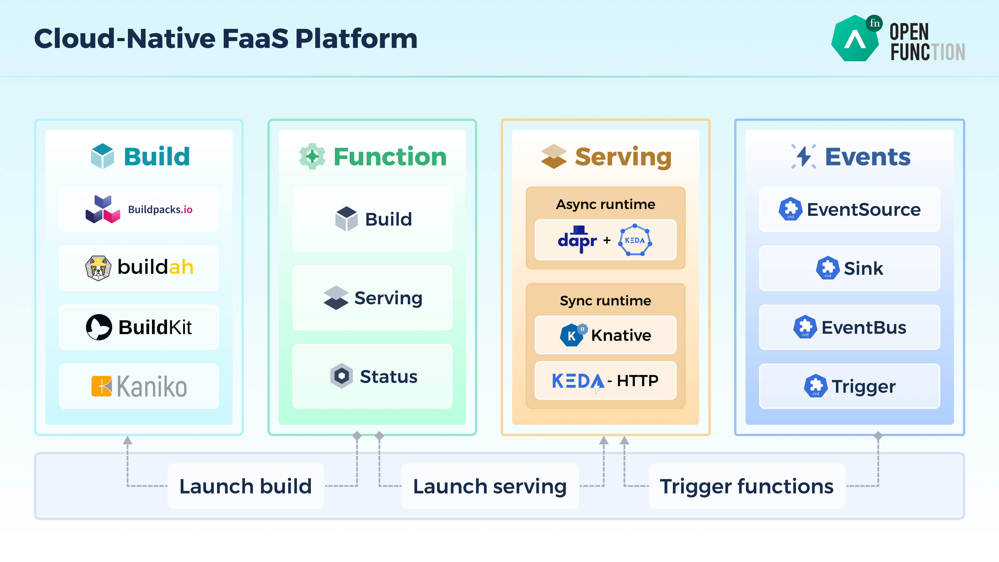

# Openfunction 

## Architecture

## _Lien_ 

| Description      | URL                                          |
| :--------------- | :------------------------------------------- |
| Platform         | https://openfunction.dev/                    |
| Meeting Calendar | https://kubesphere.io/contribution/          |
| Gtihub           | https://github.com/OpenFunction/OpenFunction |

## OpenFunction Features
- Cloud agnostic and decoupled with cloud providers’ BaaS
- Pluggable architecture that allows multiple function runtimes
- Support both sync and async functions
- Unique async functions support that can consume events directly from event sources
- Support generating OCI-Compliant container images directly from function source code.
- Flexible autoscaling between 0 and N
- Advanced async function autoscaling based on event sources’ specific metrics
- Simplified BaaS integration for both sync and async functions by introducing [Dapr](https://dapr.io/)
- Advanced function ingress & traffic management powered by (K8s Gateway API)[https://gateway-api.sigs.k8s.io/]
- Flexible and easy-to-use events management framework