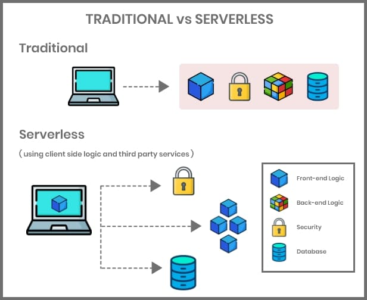
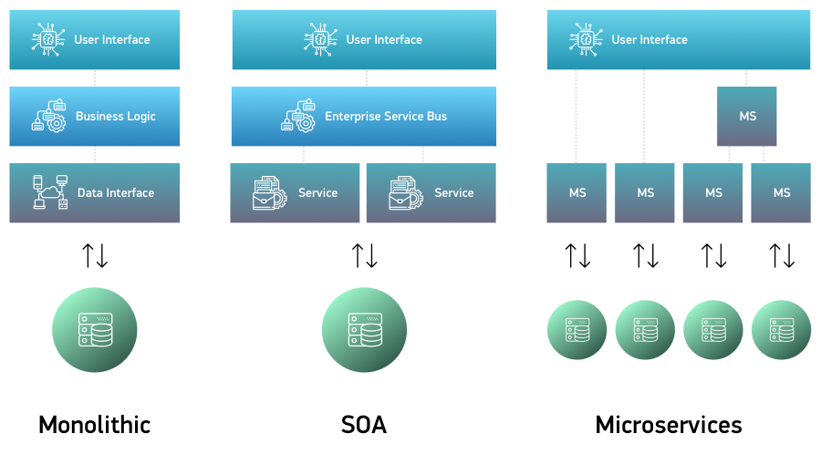
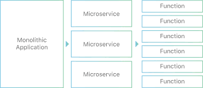
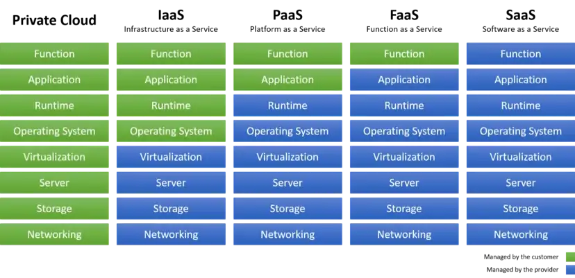
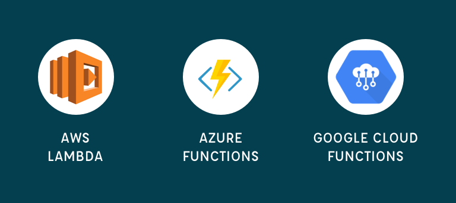

# Function as a service / Serverless Architectures
## Serverless Architectures
L'informatique sans serveur ou serverless computing est un paradigme de cloud computing dans lequel le fournisseur de serveur gère dynamiquement les ressources allouées au service client. Le prix dépend des ressources effectivement consommées et non des capacités d'un serveur acheté à l'avance.

Autrement dit , une architecture sans serveur est une méthode permettant de créer et d'exécuter des logiciels et des services sans avoir à gérer des serveurs. Dans une architecture sans serveur, le serveur sera géré par fournisseur et non par consommateur.

Dans l'architecture sans serveur, il existe deux principaux types de services : -

- Fonction en tant que service (FaaS) .
- Back-end en tant que service (BaaS) .

## Qu'est-ce que le FaaS ?

La fonction en tant que service est un type de service dans lequel toutes les fonctionnalités de l'application sont déployées dans une fonctionnalité unique, puis chaque fonctionnalité est hébergée individuellement par le fournisseur. En utilisant la fonction en tant que service, vous pouvez créer votre application en fonctionnalités indépendantes uniques.

Pour héberger l'application sur Internet, il faut une sorte d'infrastructure de serveur virtuel. Cela implique également la gestion du système d'exploitation, des serveurs Web, etc. En fonction en tant que service, toutes ces choses sont gérées par le fournisseur et non par le consommateur.

## historique d'architecture entreprise

### de microservice vers les **Function**

## Cloud Service

### Voici des exemples de fournisseurs FaaS :

- Fonctions IBM Cloud
- Fonctions Microsoft Azure (open source)
- AWS Lambda, par Amazon
- Fonctions Google Cloud
- OpenFaaS (open-source) 

### _Principaux fournisseurs de FaaS_

Référencdes 
https://medium.com/@tanmayct/serverless-architecture-function-as-a-service-19e127b8c990

